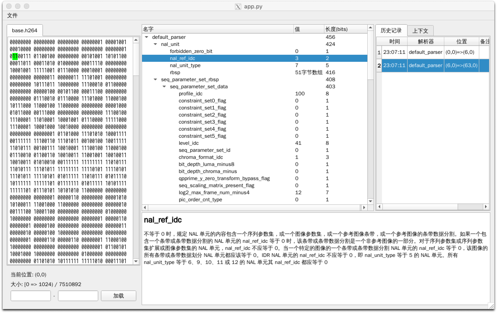
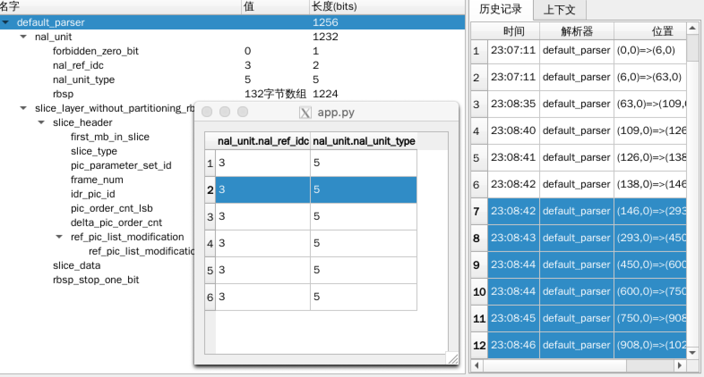
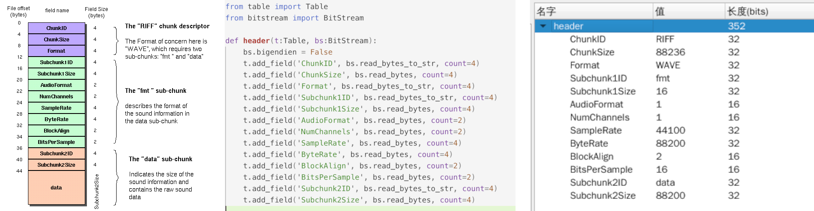

这是一个通用的二进制数据分析工具。

# 它能做什么

- 分析任意格式的二进制数据，还能同时查看协议文档
- 逐字节、逐位分析
- 手动、自动分析
- 对分析结果建透视图，发现规律，学习协议

# 怎么做到的

- 工具以插件化方式扩展协议的支持
- 定义了易用的API供插件开发。插件中的协议解析代码几乎可以做到与协议文档逐行对应
- 以markdown管理协议文档，既可以脱离工具翻阅，又可以在工具中自动呈现关联文档

# 运行截图

主窗口运行效果



透视图（根据分析需求自定义字段）



插件开发示意（图中从左到右：wav头格式，插件解析代码，工具运行效果）



# 开发中

项目已经能基本运行，且支持了部分的wav/ts/h264协议，下载源码搭建python环境可以看到初步效果

在开发：

- 界面与交互的完善
- 工作区的概念（可保存和恢复操作记录）
- 完善插件开发文档

# 如何运行

后续计划为linux/mac/windows三个平台发布可执行程序

现在还只能在python环境下运行

```
pip install -r requirements.txt
python app.py
```

如果通过`requirements.txt`按照碰到问题，也可以直接运行`python app.py`，根据提示安装缺少的模块。

一般需要：

```
pip install markdown2
pip install PySide2
```

需要运行环境：python3

# 需要你的帮助

这个工具的核心思想是“一个协议，一个插件；一次开发，永久受益”。

因此，只有众人拾柴，一起贡献各种协议、文件格式的解析插件，才能让工具真正强大起来。

欢迎通过pull request的方式提交插件扩展。