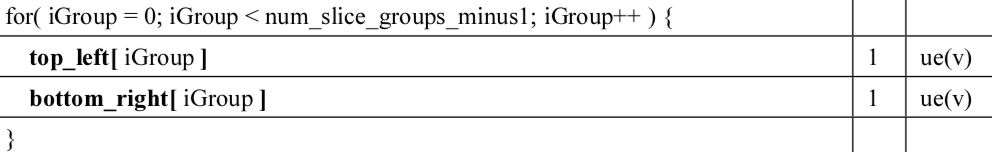

# 目录结构

插件在目录`plugins/`下

一个插件需要具备以下目录结构体（以`plugins/wav`为例）：

```
wav
├── doc.md
└── main.py
```

- wav: 顶级目录名。一般以文件格式的后缀作为目录名，这允许程序在打开文件的时候能够自动加载所需插件。
- main.py: 这里定义了为这个格式设计的解析器。加载插件的时候会扫描这个文件内的函数，创建解析器
- doc.md: 这里描述解析语法

# 解析器

签名形如`def func(t:Table, bs:BitStream)`的函数被称为解析器。

在一个`main.py`中可以定义多个解析器（比如h264插件，就定义了`nal_unit/slice_header/pic_parameter_set_rbsp`等解析器）

编写解析器只需要了解两个类：`Table`和`BitStream`

`Table`定义在`table.py`。解析器输出的字段存放在这里。

常见函数有`add_field`和`add_table`，可以分别添加一个字段，或添加字段集（即Table嵌套）。

比如wav插件中，要输出一个`ChunkID`字段，调用`add_field`即可：`t.add_field('ChunkID',...`

`BitStream`定义在`bitstream.py`。为解析器提供比特流，可以按比特或按字节读取数据。

基础函数有`read_bits`，`read_bytes`，`read_a_bit`，`read_a_byte`，`read_bytes_to_str`等

还会根据需要，提供和扩展一些解码函数，如`read_ue_glomb`

了解了这两个文件的API后，就可以开始编写插件了。

如`wav`插件的编写，示例如下。

首先理解wav格式：


接着，按照插件目录结构，创建`plugins/wav`目录：

```
wav
├── doc.md
└── main.py
```

最后，在main.py中根据wav格式编写代码：

```python
from table import Table
from bitstream import BitStream

def header(t:Table, bs:BitStream):
    bs.bigendien = False
    t.add_field('ChunkID', bs.read_bytes_to_str, count=4)
    t.add_field('ChunkSize', bs.read_bytes, count=4)
    t.add_field('Format', bs.read_bytes_to_str, count=4)
    t.add_field('Subchunk1ID', bs.read_bytes_to_str, count=4)
    t.add_field('Subchunk1Size', bs.read_bytes, count=4)
    t.add_field('AudioFormat', bs.read_bytes, count=2)
    t.add_field('NumChannels', bs.read_bytes, count=2)
    t.add_field('SampleRate', bs.read_bytes, count=4)
    t.add_field('ByteRate', bs.read_bytes, count=4)
    t.add_field('BlockAlign', bs.read_bytes, count=2)
    t.add_field('BitsPerSample', bs.read_bytes, count=2)
    t.add_field('Subchunk2ID', bs.read_bytes_to_str, count=4)
    t.add_field('Subchunk2Size', bs.read_bytes, count=4)
```

> bs.bigendien = False，让bitstream以小端形式读取整形值。（字符串默认都是大端，即使bigendien=False）

这样就完成了一个wav插件的编写（只是这里我们只定义了一个解析器）

# 文档

文档以markdown语法编写。

编写过程中**标题**需要遵守本工具的特定规则，以允许工具能正确建立字段和文档的对应关系。

标题规则如下：

- 一级标题需要是解析器名（考虑嵌套Table时，准确的说法是一级标题需要是Table名）
- 二级标题需要是字段名
- 不支持三级及以上标题

如，wav中doc.md截取如下：

```markdown
# header


## ChunkID

Contains the letters "RIFF" in ASCII form
```

一级标题header与解析器`header`同名； 

二级标题ChunkID与解析器`header`中的`ChunkID`同名，其中`ChunkID`是表`header`中通过`add_field`添加的

这样当用户通过工具选择到header时，将会在文档窗口呈现`img/wav-sound-format.gif`图片，选择`ChunkID`时，将会呈现`Contains the letters "RIFF" in ASCII form`这段文本。

# 高级特性

## 默认解析器

默认解析器是方便用户快捷使用的别名，在工具中通过`Ctrl+D`触发。

在`main.py`中名为`default_parser`的函数将被加载为默认解析器。

因为默认解析器一般会被连续调用，因此，默认解析器应当具备自动识别语法边界的能力。

具体而言，以h264为例。 h264的nalu一般以`00 00 00 01`或`00 00 01`开头，因此，其`default_parser`会先在`bitstream`中查找该特征定位到nalu，然后开始解析。

如果`main.py`没有指定默认解析器，则插件加载时第一个被加载的解析器作为默认解析器（一般是按字母序）

## 上下文

某些格式的解析需要依赖之前的解析结果。

比如h264的`slice_header`解析中需要参考pps/sps。

用户使用工具时，会手动将所需的pps/sps添加到上下文中。

插件编写中，需要从`Table.context`中读取，如果未读到，需要抛出异常提示用户。

如:

```python
try:
    nal_unit = d.context.nal_unit
except AttributeError as e:
    raise Exception('no nal_unit in ctx, abort!')
```

## 复杂字段

有时候会碰上复杂的字段定义，比如h264 pps中的：



因为`top_left`和`bottom_right`是在一个循环中交替赋值的，所以不能通过简单地`add_field`或者`add_table`取定义。

```python
def __read_topleft_bottomright(d, bs):
    d.top_left = []
    d.bottom_right = []
    for i in range(d.num_slice_groups_minus1+1):
        d.top_left.append(bs.read_ue_golomb())
        d.bottom_right.append(bs.read_ue_golomb())

d.add_fields(__read_topleft_bottomright, 'top_left', 'bottom_right')
```

这时通过`add_fields`一次性定义多个字段（缺点是这几个字段的位置信息会是一样的）