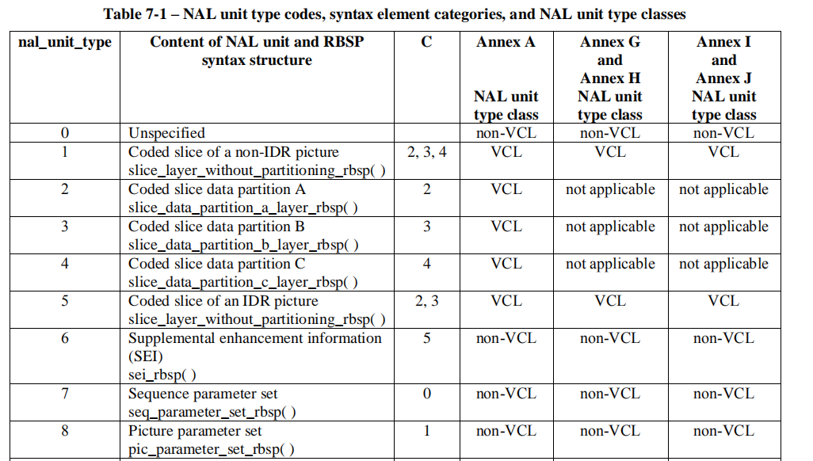
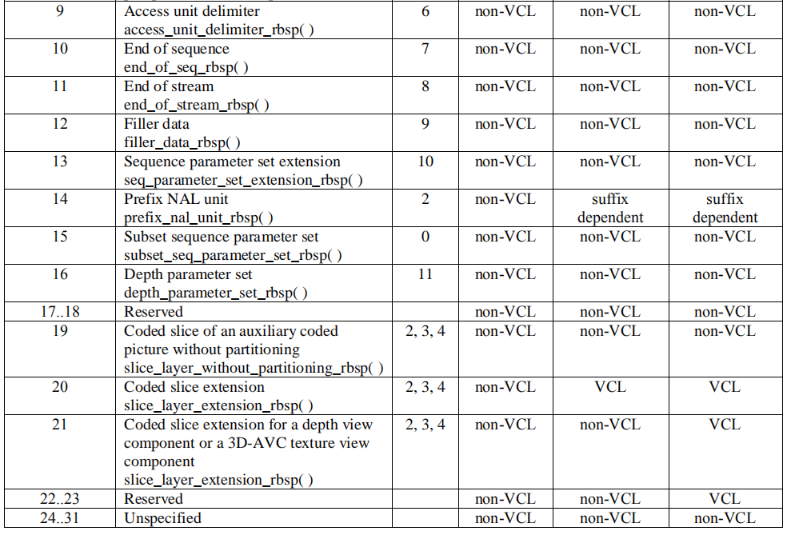

# nal_unit

## nal_ref_idc 

不等于 0 时，规定 NAL 单元的内容包含一个序列参数集，或一个图像参数集，或一个参考图像条带，或一个参考图像的条带数据分割。如果一个包含一个条带或条带数据分割的 NAL 单元的 nal_ref_idc 等于 0 时，该条带或条带数据分割是一个非参考图像的一部分。对于序列参数集或序列参数集扩展或图像参数集的 NAL 单元，nal_ref_idc 不应等于 0。当一个特定的图像的一个条带或条带数据分割 NAL 单元的 nal_ref_idc 等于 0，该图像的所有条带或条带数据划分 NAL 单元都应该等于 0。IDR NAL 单元的 nal_ref_idc 不应等于 0，即 nal_unit_type 等于 5 的 NAL 单元。所有 nal_unit_type 等于 6、9、10、11 或 12 的 NAL 单元其 nal_ref_idc 都应等于 0

## nal_unit_type

# slice_header

## slice_type

| slice_type | Name of slice_type |
| ---------- | ------------------ |
| 0          | P (P slice)        |
| 1          | B (B slice)        |
| 2          | I (I slice)        |
| 3          | SP (SP slice)      |
| 4          | SI (SI slice)      |
| 5          | P (P slice)        |
| 6          | B (B slice)        |
| 7          | I (I slice)        |
| 8          | SP (SP slice)      |
| 9          | SI (SI slice)      |

When slice_type has a value in the range 5..9, it is a requirement of bitstream conformance that all other slices of the 
current coded picture shall have a value of slice_type equal to the current value of slice_type or equal to the current valueof slice_type minus 5.NOTE 1 – Values of slice_type in the range 5..9 can be used by an encoder to indicate that all slices of a picture have the same value of (slice_type % 5). Values of slice_type in the range 5..9 are otherwise equivalent to corresponding values in the range 0..4.When nal_unit_type is equal to 5 (IDR picture), slice_type shall be equal to 2, 4, 7, or 9.When max_num_ref_frames is equal to 0, slice_type shall be equal to 2, 4, 7, or 9.

## frame_num

图像标识，主要表示当前帧是否作为其他帧的参考帧。

IDR帧frame_num为0。

根据编码顺序，设当前帧作为某一帧的参考帧，则下一帧的frame_num在其基础上加1,否则，保持frame_num不变

## pic_order_cnt_lsb

即POC。

pic_order_cnt_lsb 表示一个编码帧的顶场或一个编码场的图像顺序数对 MaxPicOrderCntLsb 取模。pic_order_cnt_lsb 语法元素的大小是 log2_max_pic_order_cnt_lsb_minus4 + 4 个比特。pic_order_cnt_lsb 的值应该在0 到 MaxPicOrderCntLsb – 1 的范围内（包括边界值）